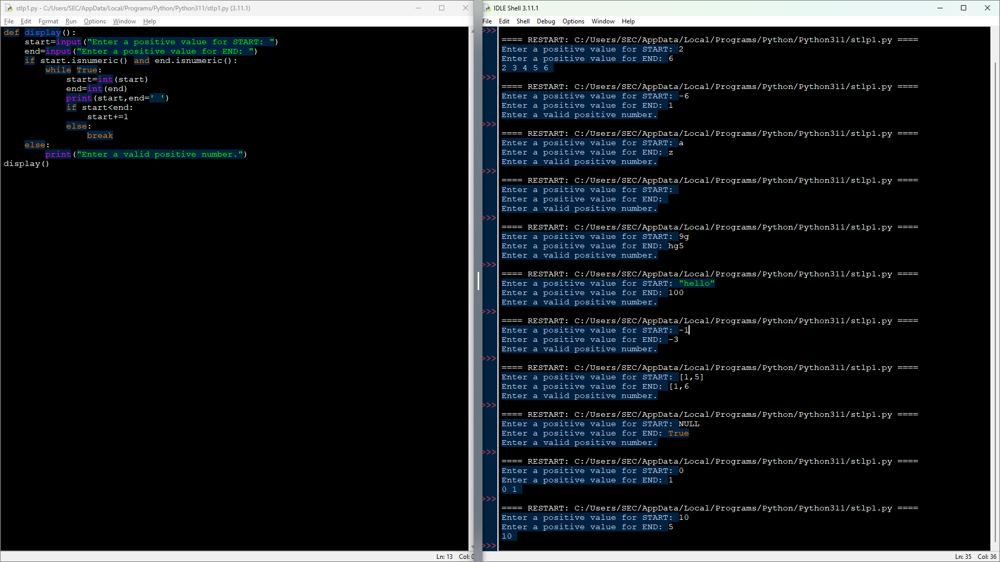
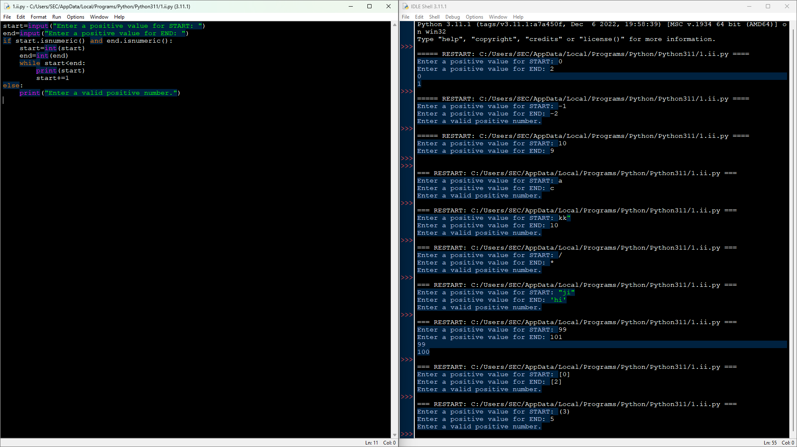
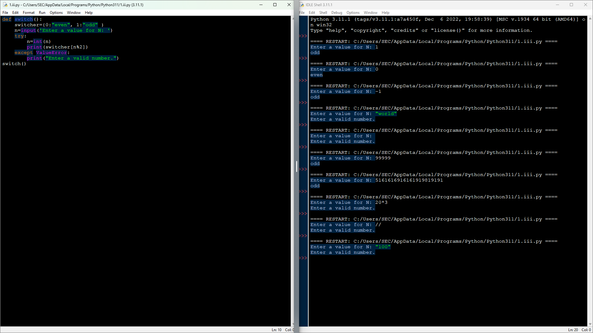
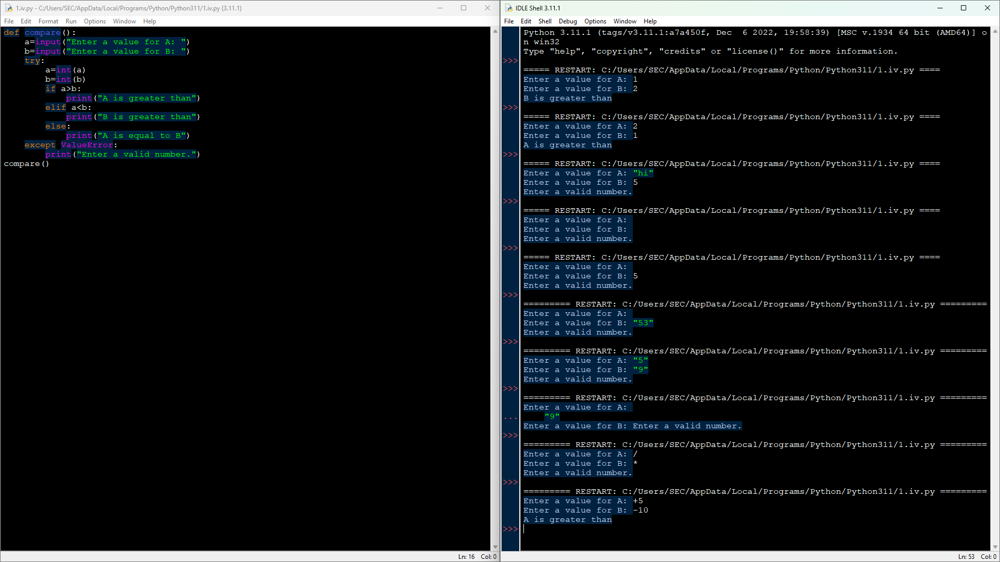
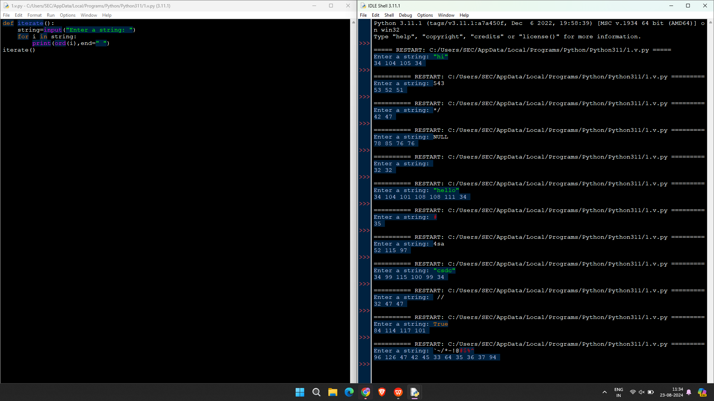

# Ex.No: 1 Write programs in Python Language to demonstrate the working of followingconstructs with possible test cases: a) do…while b) while…do c) if …else d) switch e) for 
                                                              
### REGISTER NUMBER : 212222040171

### AIM:  
To write python programs for do…while, while, for, switch and if…else and test with possible test 
Cases 

### Algorithm:
1. Start the program.
2. Create separate files for each given program.
3. Write simple program for each construct.
4.  the program with possible test cases.
5. Stop the program.
### Program:
####1)do...while
```
def display(): 
    start=input("Enter a positive value for START: ") 
    end=input("Enter a positive value for END: ") 
    if start.isnumeric() and end.isnumeric(): 
        while True: 
            start=int(start) 
            end=int(end) 
            print(start,end=' ') 
            if start<end: 
                start+=1 
            else: 
                break 
    else: 
        print("Enter a valid positive number.")
display()
```
####2)while..do
```
start=input("Enter a positive value for START: ") end=input("Enter 
a positive value for END: ") 
if start.isnumeric() and end.isnumeric(): 
start=int(start) 
end=int(end) 
while start<end: 
print(start) 
start+=1 
else: 
print("Enter a valid positive number.")
```
####3)switch
```
def switch(): 
switcher={ 
0:"even", 
1:"odd" 
} 
n=input('Enter a value for N: ') try: 
n=int(n) 
print(switcher[n%2]) 
except ValueError: 
print("Enter a valid number.") 
switch()
```

####4)if else
```
def compare(): 
a=input("Enter a value for A: ") 
b=input("Enter a value for B: ") 
try: 
a=int(a) 
b=int(b) 
if a>b: 
print("A is greater than") 
elif a<b: 
print("B is greater than") 
else: 
print("A is equal to B") 
except ValueError: 
print(“Enter a valid number.”)
```
####5)for
```
def iterate(): 
string=input("Enter a string: ") for 
i in string: 
print(ord(i),end=" ") 
iterate()
```


### Output:


    


### Result:
Thus, the python program to demonstrate the working of given constructs is implemented and the output is verified successfully.


