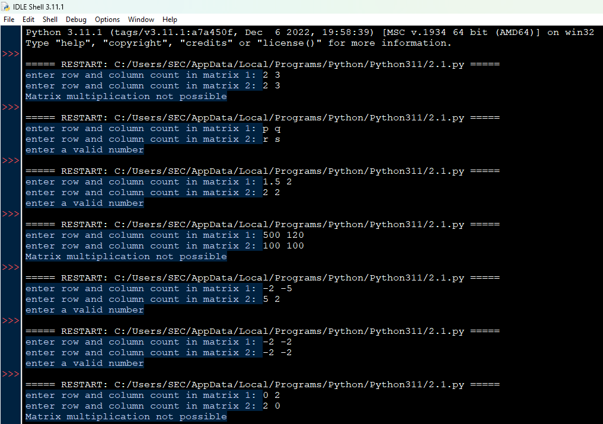

# Ex.No: 2   Matrix Multiplication 
                                                                         
### REGISTER NUMBER : 212222040171

### AIM: 
Write a python program for matrix multiplication and inspect for failures.
 
### Algorithm:

Algorithm:
1. Start the program.
2. Create empty list formatrix1, matrix2 and result.
3. Get the rows and columns count from the user.
4. Get the values of two matrix.
5. Perform matrix multiplication and store the answer in result.
6. Stop the program.
### Program:
```
r1,c1=input("enter row and column count in matrix 1: ").split() 
r2,c2=input("enter row and column count in matrix 2: ").split() 
matrix1=[ ] 
matrix2=[ ] 
result=[ ] 
if(r1.isnumeric() and c1.isnumeric() and r2.isnumeric() and c2.isnumeric()):
    r1=int(r1)
    r2=int(r2)
    c1=int(c1)
    c2=int(c2) 
    if(c1!=r2): 
        print("Matrix multiplication not possible") 
    elif (max(r1,c1,r2,c2)>20 or min(r1,c1,r2,c2)==0): 
        print("Matrix multiplication not possible") 
    else: 
        for i in range(r1): 
            a=[] 
            for j in range(c1): 
                a.append(int(input("<-"))) 
                matrix1.append(a) 
        for i in range(r2):
            a=[] 
            for j in range(c2): 
                a.append(int(input("<-"))) 
                matrix2.append(a) 

        for i in range(r1): 
            inter=[] 
            for j in range(c2): 
                sum=0 
                for k in range(r2): 
                    sum += matrix1[i][k] * matrix2[k][j] 
                inter.append(sum) 
            result.append(inter) 
        for i in range(r1): 
            for j in range(c2): 
                print(result[i][j],end="") 
            print()
            
else: 
    print("enter a valid number")
```


### Output:





### Result:
Thus, the python program for matrix multiplication is implemented and the causes for its failure is introspected successfully.

